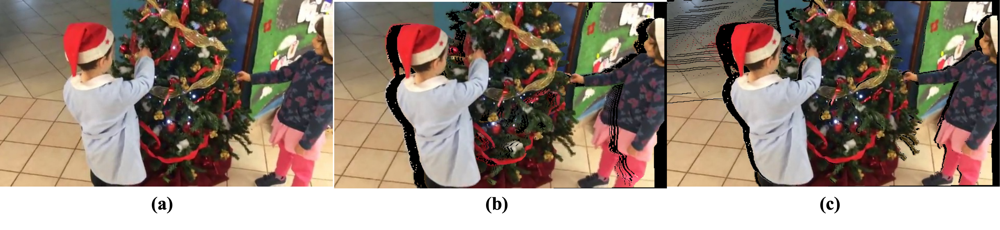
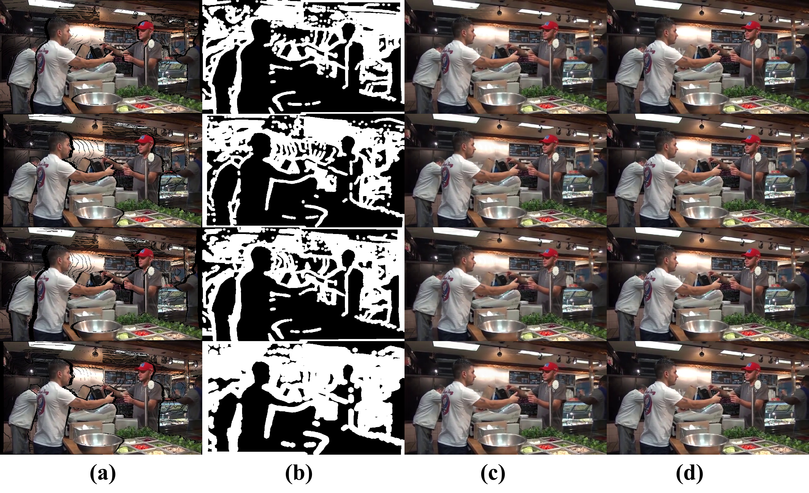
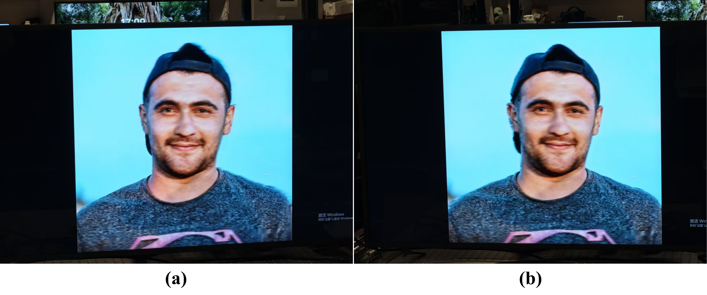
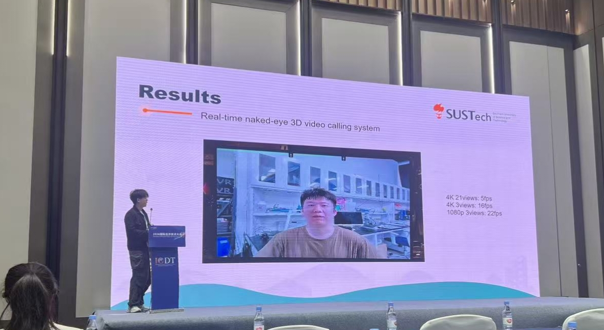

# DepthWarpVS

面向单目新视角合成与裸眼 3D 显示的深度引导式 warp-and-refine 管线。

本仓库围绕一条务实且可落地的路线展开：先从单张 RGB 图像及其深度图出发，利用深度引导前向投影生成目标视角，再显式定位由遮挡与深度边界误差带来的空洞和污染区域，最后仅对这些不可靠区域进行轻量级掩码引导修复，并将多视图结果融合为适用于柱状透镜等场景的裸眼 3D 输出。

当前代码库同时包含两部分内容：

- 完整研究工作区：覆盖训练、数据准备、实验与工具链
- `reduced_core/` 最小可部署流程：聚焦新视角生成与推理落地

## 方法概览



整个方法可以概括为以下 6 个步骤：

1. 输入单视图 RGB 图像及对应深度
2. 使用深度引导前向 splatting 生成目标相机位姿下的视图
3. 通过可见性累积定位空洞区域
4. 使用 `pollute` 带和 `valid` 掩码显式描述边界不可靠区域
5. 使用 MGMI 细化网络，仅对空洞或污染区域进行修复，可选叠加人体先验
6. 将生成的多视图进一步融合为裸眼 3D 输出

## 结果展示

### 定性对比



### 实时显示示例



### 会场实拍

下图展示了该系统在会场中的实际展示效果，可作为裸眼 3D 视频通话场景下的落地示例。



## 主要特点

- 基于深度引导的单目新视角生成
- 使用前向 splatting 处理多视图重投影
- 在 `softmax_splat` 中显式处理硬遮挡与软遮挡问题
- 只对局部空洞区域做修复，而非整图重生成
- 使用 `hole`、`valid`、`pollute` 三类显式通道保持训练与推理一致
- 支持可选人体先验：人物分割、人体 parsing、关键点等
- 可在投影前进行边缘锐化，减弱前景背景撕裂
- 支持单图、文件夹、视频三种推理模式
- 保留训练、消融与左右视图评估等研究接口

## 仓库中最值得关注的部分

### 核心推理路径

- [`reduced_core/depth_warp_vs/main.py`](reduced_core/depth_warp_vs/main.py)
- [`reduced_core/depth_warp_vs/models/splatting/softmax_splat.py`](reduced_core/depth_warp_vs/models/splatting/softmax_splat.py)
- [`reduced_core/depth_warp_vs/models/refiner/MGMI.py`](reduced_core/depth_warp_vs/models/refiner/MGMI.py)

### Refiner 训练路径

- [`data/mannequin_refine_dataset.py`](data/mannequin_refine_dataset.py)
- [`engine/trainer_refiner.py`](engine/trainer_refiner.py)
- [`configs/mgmi_refiner_train.yaml`](configs/mgmi_refiner_train.yaml)
- [`configs/mgmi_refiner_train_prior.yaml`](configs/mgmi_refiner_train_prior.yaml)

### 数据准备与评估

- [`scripts/prepare_simwarp_new.py`](scripts/prepare_simwarp_new.py)
- [`scripts/prepare_priors_dataset.py`](scripts/prepare_priors_dataset.py)
- [`reduced_core/compare/eval_left_right_vda_prior.py`](reduced_core/compare/eval_left_right_vda_prior.py)

### 补充说明

- [`reduced_core/README_REDUCED.md`](reduced_core/README_REDUCED.md)：最小部署版说明
- [`docs/reports/Agent_depth_warp_vs-CN.md`](docs/reports/Agent_depth_warp_vs-CN.md)：当前库的中文技术总结

## 仓库结构

```text
depth_warp_vs/
├── README.md
├── assets/readme/                  # README 使用的图示
├── assets/raw/                     # 体积较大的示例素材
├── docs/reports/                   # 项目报告与技术说明
├── configs/                        # 训练/推理配置
├── data/                           # 数据集、相机工具与 refiner 数据组织
├── engine/                         # 训练与评估循环
├── legacy/                         # 已归档或被替代的旧入口
├── models/                         # splatting、refiner、loss、geometry 等模块
├── reduced_core/                   # 精简版 warp + refiner + fusion 管线
├── runtime/                        # 服务化 / 运行时相关代码
├── scripts/                        # 数据准备、训练、导出、演示脚本
├── tools/                          # 分析、调试、流式处理等工具
├── third_party/Video-Depth-Anything
├── workspace/                      # 本地实验与临时大文件
└── tests/
```

## 安装

仓库根目录本身就是 Python 包 `depth_warp_vs`，最稳妥的方式是在它的父目录下运行命令。

### 1. 安装依赖

在本仓库的父目录中执行：

```bash
cd /Users/yjy/Desktop/3DView/Zhan
pip install -r depth_warp_vs/requirements.txt
```

如果你只需要最小推理流程，那么 [`reduced_core/depth_warp_vs/requirements.txt`](reduced_core/depth_warp_vs/requirements.txt) 通常已经足够。

### 2. 可选组件

- [Video-Depth-Anything](third_party/Video-Depth-Anything)：用于单目视频深度估计
- `mediapipe`：用于轻量级人物分割与关键点
- `sam2` 及本地权重：用于更强的人体先验分割
- `torch-scatter`：作为 splatting 相关加速的可选依赖

## 快速开始

### 单张图像新视角生成

推荐路径是运行 `reduced_core/` 中的最小管线：

```bash
cd /Users/yjy/Desktop/3DView/Zhan
PYTHONPATH=/Users/yjy/Desktop/3DView/Zhan/depth_warp_vs/reduced_core \
python -m depth_warp_vs.main \
  --image /path/to/source.png \
  --depth /path/to/depth.png \
  --refiner_ckpt /path/to/refiner_ema_best.pth \
  --out /path/to/output.png
```

常用选项：

- `--num_per_side`：左右两侧各生成多少个视图
- `--tx_max` 或 `--max_disp_px`：目标视差强度
- `--manual_K fx,fy,cx,cy`：手动指定内参
- `--warp_edge_sharpen`：在投影前裁掉模糊边界像素
- `--refiner_use_pollute`：启用 `pollute` 通道
- `--prior_person_seg`：叠加人物分割先验
- `--save_views_dir`：保存融合前的所有生成视图

### 视频推理

```bash
cd /Users/yjy/Desktop/3DView/Zhan
PYTHONPATH=/Users/yjy/Desktop/3DView/Zhan/depth_warp_vs/reduced_core \
python -m depth_warp_vs.main \
  --video /path/to/rgb.mp4 \
  --depth_video /path/to/depth.mp4 \
  --refiner_ckpt /path/to/refiner_ema_best.pth \
  --out /path/to/out.mp4 \
  --num_per_side 1 \
  --max_disp_px 25 \
  --manual_K 1402.1,1402.1,968.77,506.154 \
  --focus_depth 5.9 \
  --ffmpeg_h264
```

### 文件夹模式推理

文件夹中建议包含：

- `frame_xxx.png` 或 `frame_xxx.jpg`
- `depth/depth_xxx.png`

然后执行：

```bash
cd /Users/yjy/Desktop/3DView/Zhan
PYTHONPATH=/Users/yjy/Desktop/3DView/Zhan/depth_warp_vs/reduced_core \
python -m depth_warp_vs.main \
  --pair_dir /path/to/pair_dir \
  --refiner_ckpt /path/to/refiner_ema_best.pth \
  --out /path/to/out.mp4
```

## 训练

当前 refiner 的训练流程建立在离线生成的 warp 样本之上。

### 1. 准备模拟 warp / hole / pollute 数据

```bash
cd /Users/yjy/Desktop/3DView/Zhan
python depth_warp_vs/scripts/prepare_simwarp_new.py \
  --root /path/to/MannequinChallenge \
  --splits train,validation,test
```

这一阶段会生成如下内容：

- `sim_warp/`
- `hole_mask/`
- `pollute_mask/`
- `edit_mask/`

### 2. 可选：准备人体先验

```bash
cd /Users/yjy/Desktop/3DView/Zhan
python depth_warp_vs/scripts/prepare_priors_dataset.py \
  --root /path/to/MannequinChallenge \
  --splits train,validation,test \
  --backend sam2 \
  --sam2_ckpt /path/to/sam2_checkpoint.pt
```

可生成的附加先验包括：

- `prior_person_seg/`
- `prior_parsing/`
- `prior_keypoints/`

### 3. 训练 6 通道 baseline refiner

```bash
cd /Users/yjy/Desktop/3DView/Zhan
PYTHONPATH=/Users/yjy/Desktop/3DView/Zhan \
python -m depth_warp_vs.scripts.train_refiner \
  --config /Users/yjy/Desktop/3DView/Zhan/depth_warp_vs/configs/mgmi_refiner_train.yaml
```

baseline 输入约定为：

`[Iw(3), hole(1), valid(1), pollute(1)]`

### 4. 训练 7 通道先验模型

```bash
cd /Users/yjy/Desktop/3DView/Zhan
PYTHONPATH=/Users/yjy/Desktop/3DView/Zhan \
python -m depth_warp_vs.scripts.train_refiner \
  --config /Users/yjy/Desktop/3DView/Zhan/depth_warp_vs/configs/mgmi_refiner_train_prior.yaml
```

当前先验配置使用：

`[Iw(3), hole(1), valid(1), pollute(1), seg(1)]`

## 评估

仓库中提供了一个使用左右视图作为伪真值对的验证脚本，也支持配合 Video-Depth-Anything 估计深度：

```bash
cd /Users/yjy/Desktop/3DView/Zhan
python depth_warp_vs/reduced_core/compare/eval_left_right_vda_prior.py \
  --refiner_ckpt /path/to/baseline_ema_best.pth \
  --refiner_ckpt_prior /path/to/prior_ema_best.pth \
  --out_dir /path/to/eval_out
```

典型输出包括：

- `metrics_summary.json`
- 各视图定量指标
- 左右视图对比可视化

## 适用场景

- 单目图像驱动的新视角生成
- 裸眼 3D 显示内容生成
- 基于深度先验的局部修复与视图补全
- 面向部署的轻量级多视图生成流程

## 说明

本仓库强调“先基于深度完成可解释的视图投影，再只对局部不可靠区域做修复”的设计思路，适合研究型验证，也适合逐步向工程推理路径收缩。
