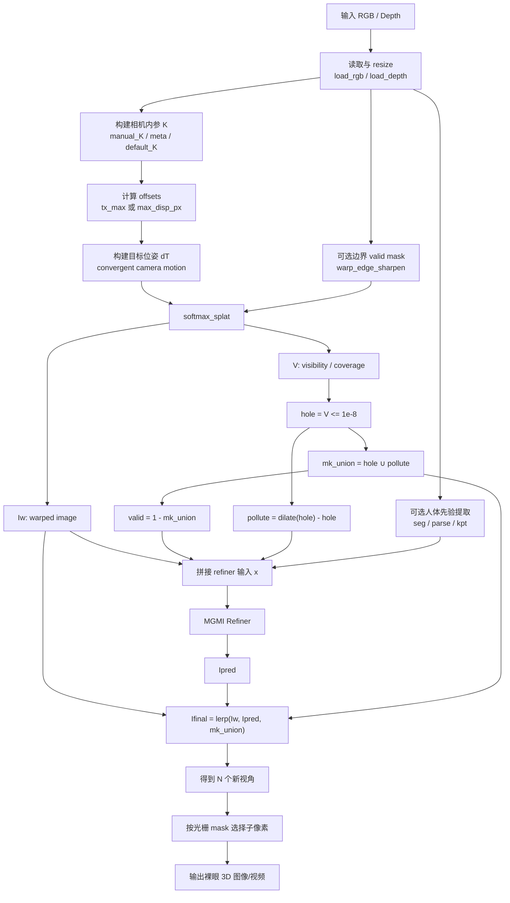

# Agent_depth_warp_vs-CN

## 0. 文档范围与说明

本文总结当前库中已经落地、可运行的主算法链路，重点覆盖：

- `reduced_core/depth_warp_vs/*` 中的推理主链路
- 根目录 `data/ / engine/ / configs/ / scripts/train_refiner.py` 中的 refiner 训练链路
- 当前版本新增的人体先验、边界锐化、`valid/pollute` 掩码机制

说明：
- 当前库并不是完整 3D 重建系统，而是“单视图 RGB + 深度 -> 多视角 warp -> 局部补洞 -> 裸眼 3D 合成”的工程实现。
- 当前主输出有两类：
  1. 新视角序列 `views`
  2. 通过光栅 mask 融合后的裸眼 3D 合成图/视频

---

## 1. 算法目标

当前库的核心目标是：

**从单张图像、图像目录或视频帧，结合对应深度图，生成一组左右新视角，再通过 refiner 修复空洞与污染区，最终得到可用于裸眼 3D 显示的融合结果。**

更细一点，当前系统解决的是以下子问题：

1. 用深度和相机模型把源视图投影到新视角。
2. 通过 splat 的可见性/覆盖度估计哪里是空洞、哪里是边缘污染带。
3. 用轻量 refiner 只修复这些局部区域，而不是整图重绘。
4. 把多个视角按显示面板的子像素/光栅规则融合为最终输出。

---

## 2. 当前算法一句话概括

当前库本质上是一个 **Depth-guided forward splatting warp + mask-guided local inpainting refiner + lenticular fusion** 的系统。

它不是显式 3D 头像建模，也不是 NeRF/Gaussian Splatting。  
它更像是一个 **基于单目深度的 2.5D 新视角生成管线**。

---

## 3. 关键入口文件

| 文件 | 作用 | 是否主入口 |
| --- | --- | --- |
| `reduced_core/depth_warp_vs/main.py` | 推理主入口，负责输入解析、深度读取、相机内参、warp、refiner、视角保存与最终融合 | 是 |
| `reduced_core/depth_warp_vs/models/splatting/softmax_splat.py` | 深度引导 forward splat，输出 warped image 和可见性覆盖图 `V` | 是 |
| `reduced_core/depth_warp_vs/models/refiner/MGMI.py` | 当前主用补洞网络，输入 `Iw + masks (+ priors)`，输出 RGB 修补结果 | 是 |
| `data/mannequin_refine_dataset.py` | 训练数据集定义，读取 `sim_warp/hole/pollute/edit/gt` 与可选先验 | 是 |
| `engine/trainer_refiner.py` | refiner 训练、验证、EMA、损失计算、checkpoint 保存 | 是 |
| `configs/mgmi_refiner_train.yaml` | 6 通道 baseline 训练配置 | 是 |
| `configs/mgmi_refiner_train_prior.yaml` | 7 通道 seg-prior 训练配置 | 是 |
| `data/build.py` | 数据集/数据加载器构建入口 | 是 |
| `models/refiner/__init__.py` | refiner 模型工厂，选择 `MGMI` 或 `InpaintRefiner` | 是 |
| `scripts/train_refiner.py` | 训练 CLI 入口 | 是 |
| `scripts/prepare_simwarp_new.py` | 训练样本生成脚本，生成 `sim_warp/hole/pollute/edit` | 上游数据准备 |
| `scripts/prepare_priors_dataset.py` | 离线生成人体先验数据 | 上游数据准备 |

---

## 4. 输入输出定义

### 4.1 推理输入

当前推理支持三种模式：

| 模式 | CLI 输入 | 说明 |
| --- | --- | --- |
| 单图模式 | `--image` + `--depth` | 单张 RGB 和单张深度图 |
| 目录模式 | `--pair_dir` | 目录内有 `frame_xxx.(jpg/png)` 与 `depth/depth_xxx.png` |
| 视频模式 | `--video` + `--depth_video` | RGB 视频和深度视频/深度帧目录 |

### 4.2 推理主张量定义

| 名称 | 形状 | 范围/类型 | 含义 |
| --- | --- | --- | --- |
| `Is` | `[1,3,H,W]` | `float32`, `[0,1]` | 输入 RGB，内部统一为 RGB 张量 |
| `Ds` | `[1,1,H,W]` | `float32`, 正数 | 输入深度，支持 `uint16`/灰度/彩色编码 |
| `Ks` | `[1,3,3]` | `float32` | 源相机内参 |
| `offsets` | `[N]` | `float list` | 视角水平位移，`N=2*num_per_side+1` |
| `dT_b` | `[N,4,4]` | `float32` | 每个目标视角的相机位姿 |
| `prior_feat` | `[1,Cp,H,W]` | `float32`, `[0,1]` | 人体先验，`Cp∈{0,1,4,5}` 等 |
| `src_valid` | `[1,1,H,W]` | `float32`, `{0,1}` | warp 前允许参与 splat 的源像素有效掩码 |

### 4.3 Warp 后中间量

| 名称 | 形状 | 含义 |
| --- | --- | --- |
| `Iw` | `[N,3,H,W]` | splat 得到的目标视角 warped 图 |
| `V` | `[N,1,H,W]` | splat 的覆盖/可见性累积图 |
| `hole` | `[N,1,H,W]` | `V<=1e-8` 得到的空洞掩码 |
| `pollute` | `[N,1,H,W]` | 由 `dilate(hole)-hole` 形成的污染带 |
| `mk_union` | `[N,1,H,W]` | `hole ∪ pollute` |
| `valid` | `[N,1,H,W]` | `1 - mk_union` |
| `x` | `[N,Cin,H,W]` | refiner 输入，当前 `Cin=6` 或 `7+` |
| `Ipred` | `[N,3,H,W]` | refiner 预测图 |
| `Ifinal` | `[N,3,H,W]` | 最终新视角图，`lerp(Iw, Ipred, mk_union)` |
| `views_bgr` | `[N,H,W,3]` | `uint8` | 保存或融合用的 BGR 新视角序列 |

### 4.4 当前 refiner 输入通道定义

#### Baseline

`x = [Iw(3), hole(1), valid(1), pollute(1)]`

总通道数：

`Cin = 6`

#### Seg prior 版本

`x = [Iw(3), hole(1), valid(1), pollute(1), seg(1)]`

总通道数：

`Cin = 7`

#### 更通用先验版本

`x = [Iw, hole, valid, pollute, seg?, parsing(3)?, kpt?]`

### 4.5 推理输出

| 输出 | 形状 | 说明 |
| --- | --- | --- |
| 多视角 `views` | `[N,H,W,3]` | 每个视角的新视图，可单独保存 |
| 融合图像 `out_bgr` | `[Hf,Wf,3]` | 通过裸眼 3D 光栅 mask 合成后的输出 |
| 视频模式输出 | 视频文件 | 每帧重复上述流程，再编码写出 |

---

## 5. 核心数据流

### 5.1 推理主链路

1. 读取 RGB 与深度，必要时 resize。
2. 解析相机内参 `K`。
3. 根据 `tx_max` 或 `max_disp_px + 参考深度` 生成一组水平位移 `offsets`。
4. 对每个位移构造 convergent camera pose `dT`。
5. 用 `softmax_splat` 将源图 forward splat 到目标视角，得到 `Iw` 与 `V`。
6. 由 `V` 计算 `hole`，再扩出 `pollute`，得到 `mk_union` 与 `valid`。
7. 拼接 refiner 输入 `x=[Iw, hole, valid, pollute, prior...]`。
8. 用 MGMI 预测 `Ipred`。
9. 只在 `mk_union` 内替换，得到 `Ifinal`。
10. 视角序列按光栅 mask 选择子像素来源，合成为最终裸眼 3D 图/视频。

### 5.2 一个关键事实

当前实现不是“全图生成新视角”，而是：

**可见区域尽量保留 warp 结果，只对空洞/污染区域做局部修复。**

因此：

- 面部主体若被判定为可见，通常会被直接 warp 保留下来。
- 变化最明显的通常是脸部轮廓、遮挡边界、脸颊外沿、下巴、头发边缘。
- 这也是当前结构容易出现“主体没怎么变，只是轮廓在动”的根本原因。

---

## 6. 训练数据定义

训练 refiner 使用的是离线生成的模拟样本，而不是在线把 `main.py` 的推理链直接塞给训练器。

### 6.1 目录组织

以 `split/clip/` 为单位，每个 clip 目录下至少包含：

- `sim_warp/warp_xxx.png`
- `hole_mask/hole_xxx.png`
- `pollute_mask/pollute_xxx.png`
- `edit_mask/edit_xxx.png`
- `frame_xxx.jpg` 或 `frame_xxx.png`

可选先验目录：

- `prior_person_seg/seg_xxx.png`
- `prior_parsing/parsing_xxx.png`
- `prior_keypoints/kpt_xxx.png`

### 6.2 训练样本输出

数据集 `MannequinRefineDataset` 返回：

- `x`: `[Cin,H,W]`
- `gt`: `[3,H,W]`
- `mk_union`: `[1,H,W]`

其中：

- `Iw` 来自离线生成的 `sim_warp`
- `hole/pollute` 来自离线 mask
- `mk_union` 来自 `hole ∪ pollute`
- `valid = 1 - mk_union`
- `gt` 来自原始真实帧

### 6.3 训练时对 mask 的处理

1. `edit_mask` 先做轻度开闭运算。
2. 训练阶段可对编辑掩码做形态学增广，提升泛化。
3. 若发现 `edit_mask=1` 但 `hole/pollute` 都是 0，会把这部分并入 `pollute`，保证 union 一致。
4. 若启用 parsing/kpt，会额外乘 `seg`，限制其只在人体区域内有效。

---

## 7. 训练目标

当前 refiner 训练的目标不是“凭空生成完整新视角”，而是：

**在 warped 图 `Iw` 的基础上，只修复 `mk_union` 指示的局部错误区域，并尽量保持 valid 区域不被破坏。**

### 7.1 前向与融合

训练时模型输出 `pred`，随后做：

`pred_final = mk_union * pred + (1 - mk_union) * Iw`

也就是说训练监督作用在融合后的结果上，而不是只监督 `pred` 本身。

### 7.2 损失组成

当前训练损失由以下部分组成：

1. `L1/Charbonnier` on `hole`
2. `L1/Charbonnier` on `pollute`
3. `L1/Charbonnier` on `valid`
4. `SSIM` on `mk_union`
5. `VGG perceptual` on `pred_final`
6. 可选 `TV regularization`
7. 多尺度训练，默认尺度 `[1.0, 0.5]`

### 7.3 权重意图

- `hole_weight` 最高，强调真正缺失区补全。
- `pollute_weight` 次高，强调边缘污染修正。
- `valid_weight` 保证非缺失区别被 refiner 乱改。
- `SSIM/VGG` 提升结构与感知质量。

---

## 8. 当前模型结构

### 8.1 Warp 部分

`softmax_splat` 做的是：

1. 用源相机把深度反投影成 3D 点。
2. 用目标相机位姿变换到目标视角。
3. 投影回目标 2D 平面。
4. 对每个点向 4 邻域做双线性 splat。
5. 遮挡支持两种模式：
   - `hard`: 近似 z-buffer
   - `soft`: 深度指数加权

输出：

- `I0`: 累积颜色图
- `V`: 累积覆盖图

### 8.2 Refiner 部分

当前主用的是 `MGMI`：

- 轻量编码器-解码器
- 使用深度可分离卷积与 inverted residual
- bottleneck 用 DW-ASPP
- 在 stem、encoder、decoder 多处加入 `MaskGate`
- `MaskGate` 会显式读取 `x[:,3:]` 的 mask/prior 通道来调制特征

这说明当前 refiner 不是完全普通的 UNet，而是一个 **显式 mask-aware 的轻量补洞网络**。

---

## 9. 关键约束

### 9.1 几何层面的约束

1. 当前相机运动是 **水平平移 + look-at 聚焦**，不是完整 6DoF 自由视角。
2. `build_convergent_camera_motion` 的位姿定义决定了当前更接近“左右眼视差生成”，不是真正大角度绕头旋转。
3. 若输入深度边缘模糊，warp 必然出现拉扯、重影和裂缝。

### 9.2 数据层面的约束

1. 深度必须和 RGB 对齐。
2. `pair_dir` 必须满足固定命名约定。
3. 训练数据集必须包含 `sim_warp/hole_mask/pollute_mask/edit_mask/frame`。
4. 如果推理用了 `valid/pollute/seg`，训练最好也使用同样通道定义，否则会出现显著的 distribution shift。

### 9.3 模型层面的约束

1. checkpoint 虽支持“重叠维度自适应加载”，但这只保证能加载，不保证效果正确。
2. 输入通道变了就应该重训，而不是长期依赖 `strict=False` 兼容。
3. 当前结构本质上仍是 2D 图像域修补，不具备真实 3D 几何补全能力。

---

## 10. 边界条件

### 10.1 输入边界条件

- 深度文件为空或无法读取：直接报错。
- `valid depth` 像素太少：参考深度回退到均值或中位数。
- 没有 `manual_K` 或 `meta K`：回退到 `default_K(H,W)`。
- 三种模式只能三选一：`image` / `pair_dir` / `video`。

### 10.2 Warp 边界条件

- `src_valid=None` 时，默认所有像素参与 splat。
- 若开启 `warp_edge_sharpen`，边界带像素会被直接排除，产生干净空洞。
- `hard` 遮挡模式若底层 `scatter_reduce` 不可用，会回退到 `soft` 模式。

### 10.3 训练边界条件

- 找不到样本时数据集直接报错。
- prior 缺失时，如果 `strict=false`，回退零先验。
- CPU 训练可跑通，但训练速度和最终收敛能力受限。

---

## 11. 当前实现中最需要注意的问题

### 11.1 2D warp 的结构性局限

这是当前库最核心的限制：

**只要新视角暴露出源视图没看到的区域，系统就只能靠局部图像先验去“补”，而不是根据真实 3D 结构去重建。**

这会直接带来：

- 鼻子后面的脸颊
- 耳朵
- 脖子被头部遮挡的区域
- 发丝层级遮挡

这些地方非常容易出错。

### 11.2 训练/推理分布不一致的风险

如果训练时看到的是“平滑拉扯边界”，推理时却改成“断崖式空洞”，refiner 很容易 OOD。

因此，凡是推理链路做了以下修改，都必须同步进训练数据生成：

- `valid` 通道
- `pollute` 定义
- `warp_edge_sharpen`
- prior 通道定义

### 11.3 面部主体常常变化不够

因为当前融合策略是：

`Ifinal = lerp(Iw, Ipred, mk_union)`

所以：

- 有效区域主要沿用 `Iw`
- refiner 只改 `mk_union`

这意味着当前系统更像“局部修洞”，不是“整脸重渲染”。  
如果面部内部大部分像素被判定为可见，那么新视角里脸的主体通常不会大改。

### 11.4 `valid` 与 `pollute` 的意义不能混用

- `hole` 是完全缺失
- `pollute` 是高风险边界带
- `valid` 是相对可信区域

这三类区域在损失设计和推理融合中的职责不同，不能简单合并成一个 mask，否则网络会丢失“哪里该补、哪里该保守”的显式信息。

---

## 12. 参数配置及意义

### 12.1 推理主参数

| 参数 | 含义 | 影响 |
| --- | --- | --- |
| `--img_size H,W` | warp 工作分辨率 | 影响速度、深度对齐和空洞大小 |
| `--fuse_size H,W` | 最终融合输出分辨率 | 影响显示输出尺寸 |
| `--manual_K` | 手动内参 `fx,fy,cx,cy` | 决定投影几何是否可信 |
| `--depth_mode` | `auto/metric/normalized` | 决定深度解释方式 |
| `--depth_scale` | 归一化深度映射尺度 | 影响几何位移量 |
| `--far_value` | 深度值越大是否更远 | 错了会导致前后关系反 |
| `--rescale_depth` | warp 前线性重标定深度 | 缓解不同深度来源尺度不一致 |
| `--num_per_side` | 每侧视角数量 | 总视角数 `2N+1` |
| `--tx_max` | 最大水平平移 | 决定新视角强度 |
| `--max_disp_px` | 若不显式给 `tx_max`，用像素视差推导位姿 | 更容易按视觉位移控制 |
| `--spacing` | `linear/cosine` | 决定视角分布 |
| `--occlusion` | `hard/soft` | 决定遮挡规则 |
| `--temperature` | soft 遮挡温度 | 控制深度加权锋利程度 |
| `--refiner_use_pollute` | 是否把污染带作为输入 | 建议开启，训推一致 |
| `--pollute_dilate_px` | 污染带半径 | 决定边界保护宽度 |
| `--warp_edge_sharpen` | 是否先断开前景边缘 | 可减少拉扯，但必须训推一致 |
| `--warp_edge_band_px` | 断开边界带宽 | 越大空洞越干净，但越难补 |
| `--prior_person_seg` | 加 1 通道人体分割先验 | 有助于边界定位 |
| `--prior_parsing` | 加 3 通道人体 parsing | 语义更强，但更易 OOD |
| `--prior_keypoints` | 加 1 通道关键点热力图 | 强调人体结构 |
| `--save_views_dir` | 保存所有新视角 | 方便外部评测 |

### 12.2 训练配置主参数

| 配置项 | 含义 |
| --- | --- |
| `data.root` | 数据集根目录 |
| `data.img_size` | 训练分辨率 |
| `data.mask_aug` | 训练时 mask 形态学增广 |
| `data.prior.*` | 是否加载 seg/parse/kpt 先验 |
| `model.refiner.in_ch` | 输入通道数，必须和数据定义一致 |
| `model.refiner.base_ch` | 网络宽度基数 |
| `model.refiner.width_mult` | MGMI 宽度倍率 |
| `loss.hole_weight_*` | hole 区域权重及其 ramp |
| `loss.pollute_weight` | 污染带权重 |
| `loss.valid_weight` | 有效区保真权重 |
| `loss.ssim/vgg/tv` | 结构、感知、平滑正则 |
| `optim.lr` | 学习率 |
| `optim.max_steps` | 最大训练步数 |
| `log.pretrained` | warm start checkpoint |

---

## 13. 从输入到推理结果的流程图

---

## 14. 当前库的最简结论

如果只用一句话总结当前实现，可以写成：

**这是一个以单目深度为几何骨架、以可见性掩码为修补范围、以 MGMI 为局部补洞器、以光栅融合为显示输出的 2.5D 新视角生成系统。**

它的优势是：

- 结构清晰
- 推理快
- 工程上容易控制输入输出
- 适合做“局部修补式”的新视角生成

它的核心短板是：

- 强依赖深度边界质量
- 新暴露区域缺少真实几何信息
- 仍然难以在较大转头/自遮挡场景下生成可信的新面部结构
- 训练和推理分布一旦不一致，容易明显退化

---

## 15. 推荐阅读顺序

如果要快速接手当前库，建议按下面顺序看代码：

1. `reduced_core/depth_warp_vs/main.py`
2. `reduced_core/depth_warp_vs/models/splatting/softmax_splat.py`
3. `reduced_core/depth_warp_vs/models/refiner/MGMI.py`
4. `data/mannequin_refine_dataset.py`
5. `engine/trainer_refiner.py`
6. `configs/mgmi_refiner_train.yaml`
7. `configs/mgmi_refiner_train_prior.yaml`

